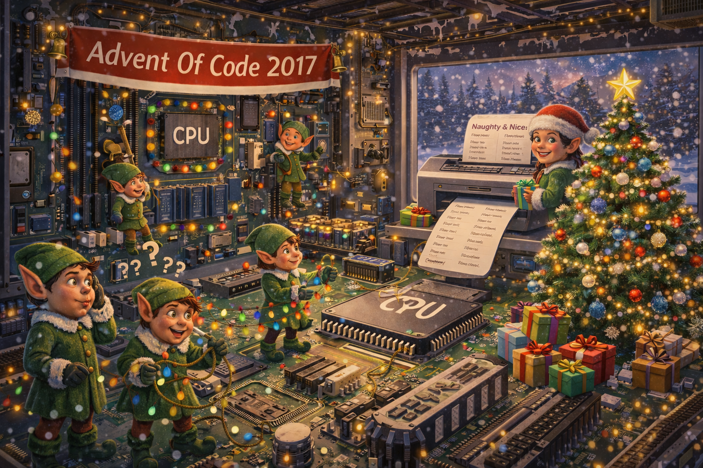

# Advent Of Code 2017 - All days complete and fully working examples
Advent Of Code 2017 solutions written using Python3



These solutions were written with python v3.14.2 installed, but have been written to be compatible with pypy3.
My version of pypy3 is 7.3.15 which is compatible with python 3.9.18.
I have used make files for ease of execution, which run the solutions using pypy3.

### To run all 25 days: ###
1. Install Python3 and Pypy3 if it is not already installed. (see above). https://www.python.org/downloads/ https://doc.pypy.org/en/stable/install.html
2. Navigate to the project root.
3. Execute the make file: 
```bash
make
```
or directly from the root using 
```bash
pypy3 ./Runner/runner.py
```
This will execut all days' projects.\
The results will be displayed in the terminal window, with execution timings for each.

### To run an individual day: ###
1. Install Python3 and Pypy3 if it is not already installed. (see above). https://www.python.org/downloads/ https://doc.pypy.org/en/stable/install.html
2. Navigate to the day (e.g. /Day01)
3. Execute the make file to run the days' solution: 
```bash
make
```
or directly from within the day root using 
```bash
pypy3 program.py input.txt
```
Change 'input.txt' to 'sample.txt' to run with the sample instead

# All results with execution timings #

## Day 1: Inverse Captcha ##
https://adventofcode.com/2017/day/1

File: Day01/input.txt\
Part 1 Result: 1393 in 7.289ms\
Part 2 Result: 1292 in 3.882ms

## Day 2: Corruption Checksum ##
https://adventofcode.com/2017/day/2

File: Day02/input.txt\
Part 1 Result: 42299 in 0.352ms\
Part 2 Result: 277 in 4.698ms

## Day 3: Spiral Memory ##
https://adventofcode.com/2017/day/3

File: Day03/input.txt\
Part 1 Result: 371 in 7.834ms\
Part 2 Result: 369601 in 0.500ms

## Day 4: High-Entropy Passphrases ##
https://adventofcode.com/2017/day/4

File: Day04/input.txt\
Part 1 Result: 383 in 2.990ms\
Part 2 Result: 265 in 20.657ms

## Day 5: A Maze of Twisty Trampolines, All Alike ##
https://adventofcode.com/2017/day/5

File: Day05/input.txt\
Part 1 Result: 326618 in 5.647ms\
Part 2 Result: 21841249 in 191.642ms

## Day 6: Memory Reallocation ##
https://adventofcode.com/2017/day/6

File: Day06/input.txt\
Part 1 Result: 6681 in 21.427ms\
Part 2 Result: 2392 in 15.444ms

## Day 7: Recursive Circus ##
https://adventofcode.com/2017/day/7

File: Day07/input.txt\
Part 1 Result: mwzaxaj in 20.675ms\
Part 2 Result: 1219 in 13.988ms

## Day 8: I Heard You Like Registers ##
https://adventofcode.com/2017/day/8

File: Day08/input.txt\
Part 1 Result: 6012 in 18.573ms\
Part 2 Result: 6369 in 9.090ms

## Day 9: Stream Processing ##
https://adventofcode.com/2017/day/9

File: Day09/input.txt\
Part 1 Result: 12396 in 9.573ms\
Part 2 Result: 6346 in 5.175ms

## Day 10: Knot Hash ##
https://adventofcode.com/2017/day/10

File: Day10/input.txt\
Part 1 Result: 4480 in 5.760ms\
Part 2 Result: c500ffe015c83b60fad2e4b7d59dabc4 in 14.425ms

## Day 11: Hex Ed ##
https://adventofcode.com/2017/day/11

File: Day11/input.txt\
Part 1 Result: 743 in 14.742ms\
Part 2 Result: 1493 in 31.083ms

## Day 12: Digital Plumber ##
https://adventofcode.com/2017/day/12

File: Day12/input.txt\
Part 1 Result: 169 in 10.636ms\
Part 2 Result: 179 in 40.596ms

## Day 13: Packet Scanners ##
https://adventofcode.com/2017/day/13

File: Day13/input.txt\
Part 1 Result: 2264 in 0.533ms\
Part 2 Result: 3875838 in 297.112ms

## Day 14: Disk Defragmentation ##
https://adventofcode.com/2017/day/14

File: Day14/input.txt\
Part 1 Result: 8106 in 409.853ms\
Part 2 Result: 1164 in 85.536ms

## Day 15: Dueling Generators ##
https://adventofcode.com/2017/day/15

File: Day15/input.txt\
Part 1 Result: 594 in 136.506ms\
Part 2 Result: 328 in 1348.720ms

## Day 16: Permutation Promenade ##
https://adventofcode.com/2017/day/16

File: Day16/input.txt\
Part 1 Result: iabmedjhclofgknp in 16.609ms\
Part 2 Result: oildcmfeajhbpngk in 119.999ms

## Day 17: Spinlock ##
https://adventofcode.com/2017/day/17

File: Day17/input.txt\
Part 1 Result: 2000 in 4.755ms\
Part 2 Result: 10242889 in 790.151ms

## Day 18: Duet ##
https://adventofcode.com/2017/day/18

File: Day18/input.txt\
Part 1 Result: 2951 in 8.425ms\
Part 2 Result: 7366 in 147.626ms

## Day 19: A Series of Tubes ##
https://adventofcode.com/2017/day/19

File: Day19/input.txt\
Part 1 Result: AYRPVMEGQ in 12.179ms\
Part 2 Result: 16408 in 8.199ms

## Day 20: Particle Swarm ##
https://adventofcode.com/2017/day/20

File: Day20/input.txt\
Part 1 Result: 457 in 30.321ms\
Part 2 Result: 448 in 837.847ms

## Day 21: Fractal Art ##
https://adventofcode.com/2017/day/21

File: Day21/input.txt\
Part 1 Result: 184 in 2.838ms\
Part 2 Result: 2810258 in 2357.668ms

## Day 22: Sporifica Virus ##
https://adventofcode.com/2017/day/22

File: Day22/input.txt\
Part 1 Result: 5246 in 17.767ms\
Part 2 Result: 2512059 in 3397.804ms

## Day 23: Coprocessor Conflagration ##
https://adventofcode.com/2017/day/23

File: Day23/input.txt\
Part 1 Result: 6724 in 27.265ms\
Part 2 Result: 903 in 1977.453ms

## Day 24: Electromagnetic Moat ##
https://adventofcode.com/2017/day/24

File: Day24/input.txt\
Part 1 Result: 1511 in 1432.422ms\
Part 2 Result: 1471 in 1421.601ms

## Day 25: The Halting Problem ##
https://adventofcode.com/2017/day/25

File: Day25/input.txt\
Part 1 Result: 3362 in 627.850ms\
Part 2 Result: 0 in 0.002ms

All solutions ran in 17.085s. 25/25 solutions passed successfully!.

# Execution Time Summary #
Day22: 3449.840ms\
Day24: 2894.920ms\
Day21: 2443.066ms\
Day23: 2038.030ms\
Day15: 1527.674ms\
Day20: 921.298ms\
Day17: 829.925ms\
Day25: 681.913ms\
Day14: 554.977ms\
Day13: 330.787ms\
Day05: 229.624ms\
Day18: 215.892ms\
Day16: 170.657ms\
Day12: 110.341ms\
Day07: 87.413ms\
Day19: 81.477ms\
Day11: 80.055ms\
Day08: 79.341ms\
Day06: 69.594ms\
Day04: 55.890ms\
Day10: 52.640ms\
Day01: 52.295ms\
Day09: 47.042ms\
Day03: 41.032ms\
Day02: 38.147ms
